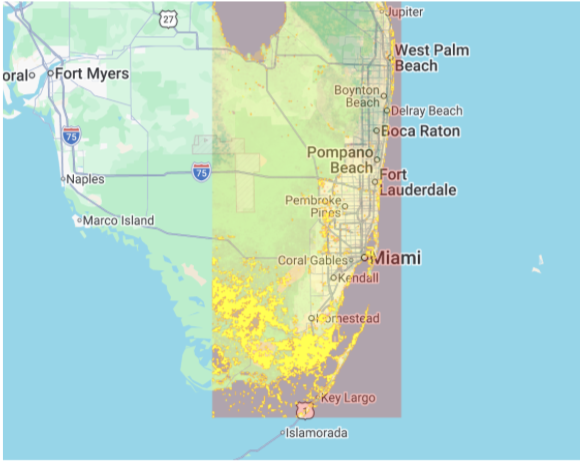
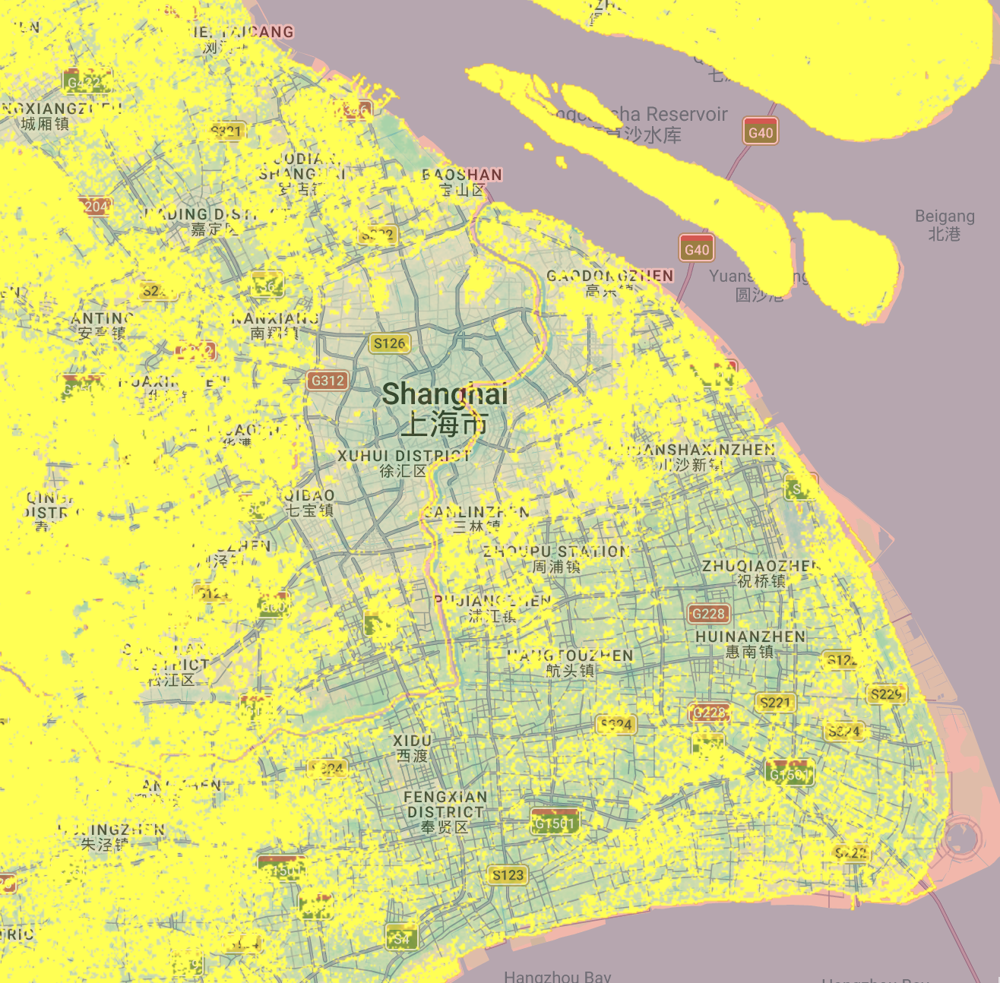
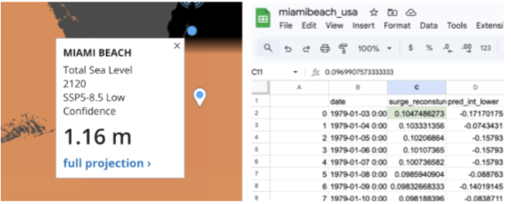

# Sea Level Rise in Miami & Shanghai 

The goal of this project is to predict which areas within coastal cities will be affected in the future due to rising sea levels for the year 2110, more specifically in Miami and Shanghai 

## Tools used: 
- Google Earth Engine
- Javascript

## Files
- `script.js` – main Earth Engine code
- `results/` – exported map visualization and data used to perform analysis 

## Datasets used: 
1) Digital elevation data for coastal areas generated by Climate Central [CoastalDEM](https://go.climatecentral.org/coastaldem) 
2) Projections of future sea level rise synthesized by the Intergovernmental Panel on Climate Change and mapped by NASA
3) Global Storm Surge Reconstruction (GSSR) dataset generated by Tadess et al. 2020.
   
## Results 

After analysis, we can see that Miami's low-lying coastal areas such as West Palm Beach, Boca Raton, and Fort Lauderdale, as well as urban regions bordering rural land like Andytown and Weston, and rural areas themselves, particularly Everglades National Park, are projected to be the most affected by future sea level rise. This high vulnerability is largely due to Miami being built on former wetlands, mangroves, and swampy ground.

In the case of Shanghai, its outer skirts will be the most affected, some districts including Songjiang, Qingpu, Jiading among others. Chongming island will be completely under water. Overall, the entire city will be vulnerable to rising sea levels, with only a portion of Puxi remaining intact. Shanghai's susceptibility to flooding can be attributed to its geolocation as well as land subsidence (sinking) caused by heavy infrastructure weight and historical groundwater extraction.

## Live GEE Script
[Click here for the Google Earth Engine script for Shanghai](https://code.earthengine.google.com/a0b09a9dda95705b57ebf94f89d96eff)

[Click here for the Google Earth Engine script for Miami](https://code.earthengine.google.com/a0b09a9dda95705b57ebf94f89d96eff)
